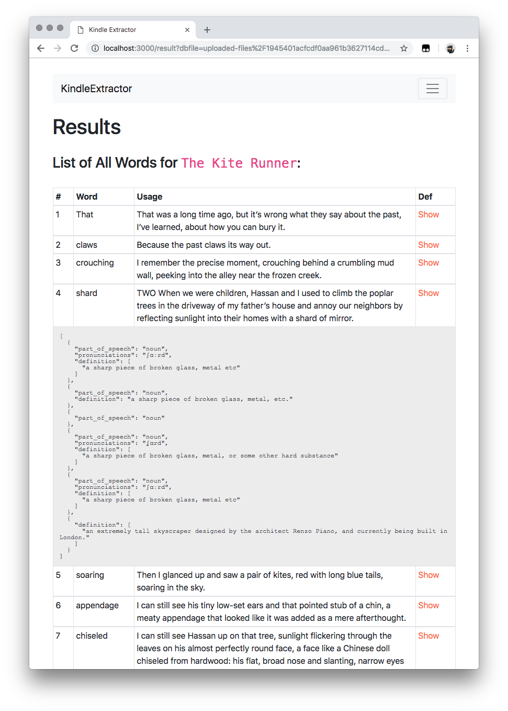

# Simple Kindle Extractor

- This is a simple app which extracts the words stored in Kindle Vocabulary builder based on a few parameters, including the Book Name or Time the word is added.
- [Longman Dictionary](https://www.ldoceonline.com/) public APIs are used for look ups.

### How to use
1. Clone the package, go to `KindleExtractor` folder, run `npm install` to get all the required packages and run the application by `npm run watch`.
2. Application should be available at `http://localhost:3000/`.
3. Plug in your Kindle and look for `vocab.db` file in `[Kindle directory]\system\vocabulary`.
4. Choose the file from the UI and Submit.

### Screenshot

